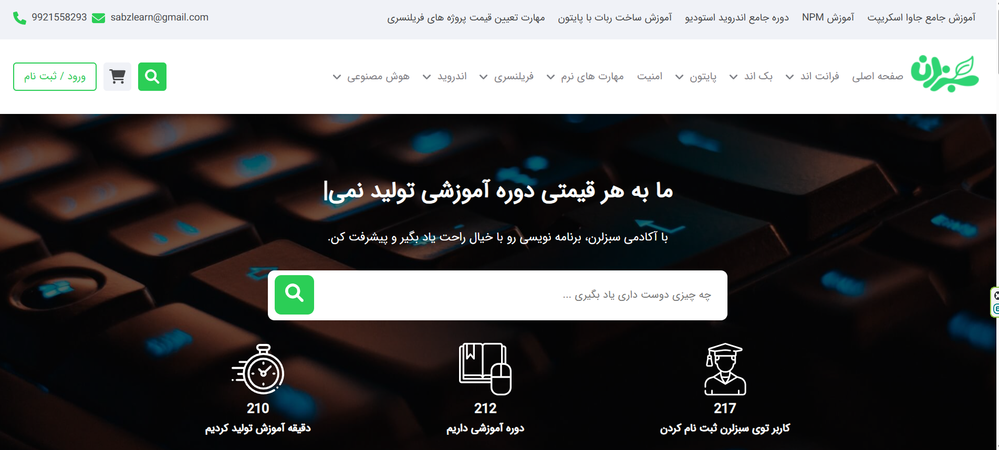
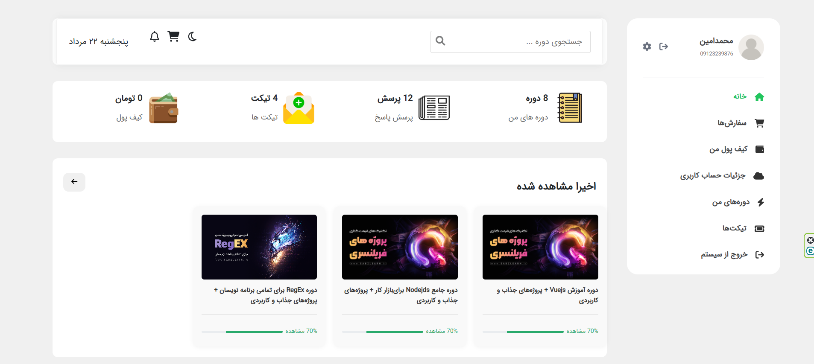
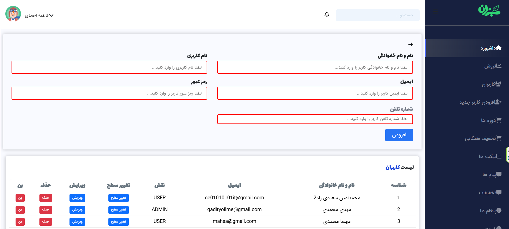
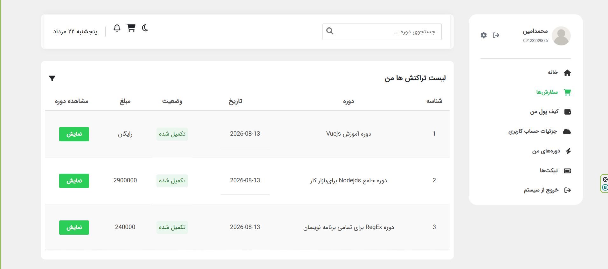

# E-learning Platform

A full-featured e-learning platform built with React and JavaScript.

The project includes a public website, user authentication, user dashboard, shopping cart functionality, and an admin panel.

🌐 Live Demo

https://e-learning-frontend-fx88d0z5v-davins-projects-ba0231a9.vercel.app

## Features

- User registration and login
- Authentication
- Course browsing
- Shopping cart
- User dashboard
- Admin panel
- REST API integration
- Client-side routing
- Shared state management
- Responsive design

## Technologies

### Frontend

- React
- JavaScript (ES6+)
- React Router
- Context API
- Fetch API
- Bootstrap
- CSS

### Backend

- Node.js
- Express
- REST API

## Screenshots

### Home Page



### User Dashboard



### Admin Panel



### Shopping Cart



## Installation

Clone the repository:

```bash
git clone https://github.com/Davin-ai/e-learning-platform.git
```

### Frontend

```bash
cd front-end
npm install
npm start
```

### Backend

```bash
cd backend
npm install
npm start
```

```bash
git clone https://github.com/Davin-ai/e-learning-platform.git
